# httpie-curl-examples

Working demo on how to use httpie and curl terminal commands (HEAD, GET, POST, PUT, PATCH, DELETE)

# Prerequisites

- [curl](https://curl.se/)
- [httpie](https://httpie.io/)
- [node.js v22](https://nodejs.org)

# Suggested

- [volta](https://volta.sh/)

# Install

```
npm install
```

# Run server

```
npm start
```

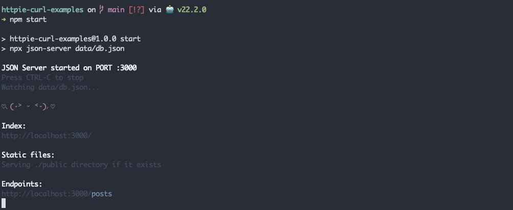

# HEAD

## curl

```
curl --head http://localhost:3000/posts
curl --I localhost:3000/posts
```

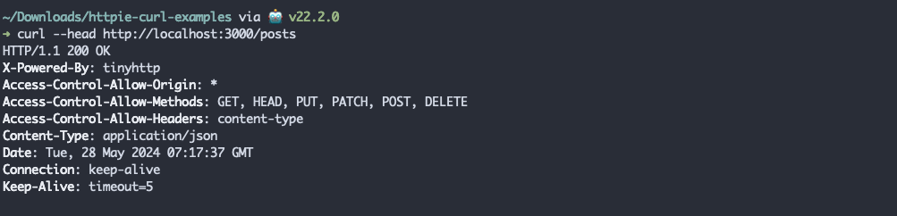

## httpie

```
http HEAD http://localhost:3000/posts
http HEAD localhost:3000/posts
```

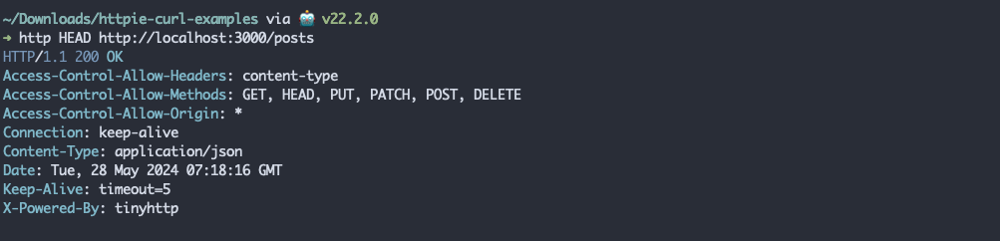

# GET

## curl

```
curl --request 'GET' http://localhost:3000/posts
curl -X 'GET' localhost:3000/posts
```

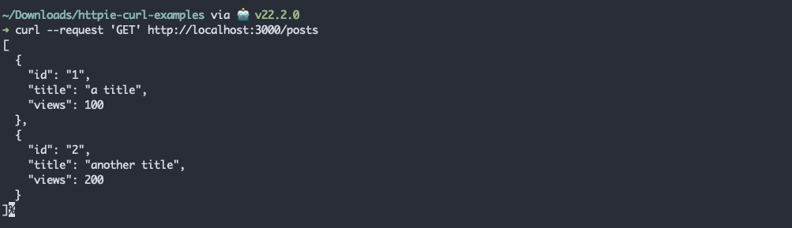

## httpie

```
http GET http://localhost:3000/posts
http localhost:3000/posts
```

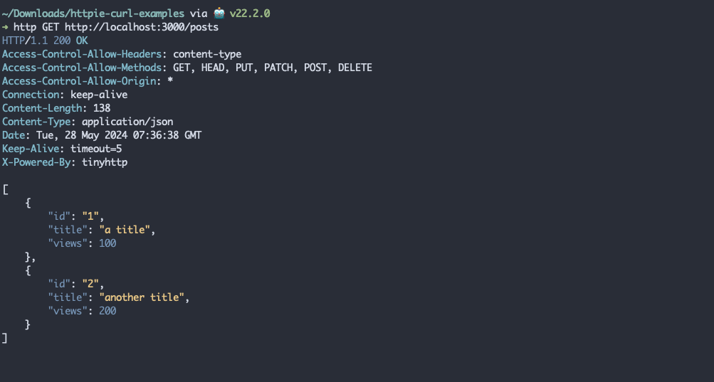

# POST

## curl

```
curl --request 'POST' http://localhost:3000/posts -d '{ "id": "3-curl", "title": "title 3-curl, post", "views": 0 }'
curl -X 'POST' localhost:3000/posts -d '{ "id": "3-curl", "title": "title 3-curl, post", "views": 0 }'
```

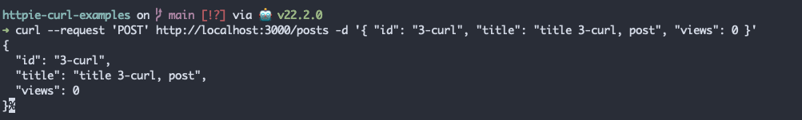

## httpie

```
http POST http://localhost:3000/posts id='3-httpie' title='title 3-httpie, post' views:=0
http localhost:3000/posts id='3-httpie' title='title 3-httpie, post' views:=0
echo '{ "id": "3-httpie", "title": "title 3-httpie, post", "views": 0 }' | http localhost:3000/posts
http localhost:3000/posts @./data/httpie-post.json
http localhost:3000/posts < ./data/httpie-post.json
```

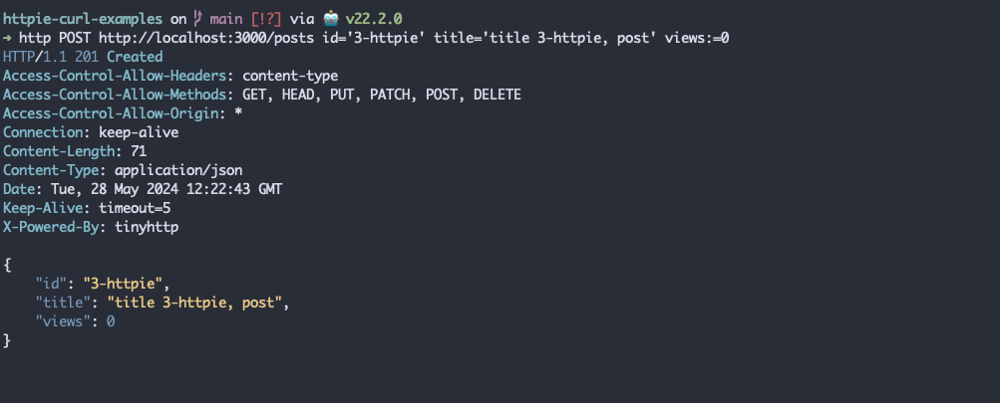

# PUT (run previously POST or return `404 Not found`)

## curl

```
curl --request 'PUT' http://localhost:3000/posts/3-curl -d '{ "id": "3-curl", "title": "title 3-curl, put", "views": 1 }'
curl -X 'PUT' localhost:3000/posts/3-curl -d '{ "id": "3-curl", "title": "title 3-curl, put", "views": 1 }'
```


## httpie

```
http PUT http://localhost:3000/posts/3-httpie id='3-httpie' title='title 3-httpie, put' views:=1
http PUT localhost:3000/posts/3-httpie id='3-httpie' title='title 3-httpie, put' views:=1
echo '{ "id": "3-httpie", "title": "title 3-httpie, put", "views": 1 }' | http PUT localhost:3000/posts/3-httpie
http PUT localhost:3000/posts/3-httpie @./data/httpie-put.json
http PUT localhost:3000/posts/3-httpie < ./data/httpie-put.json


```

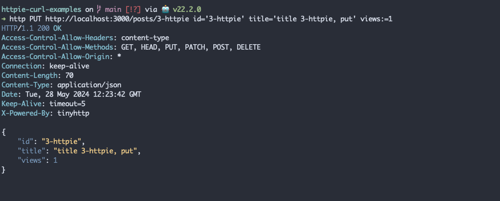

# PATCH (run previously POST, optionally PUT, or return `404 Not found`)

## curl

```
curl --request 'PATCH' http://localhost:3000/posts/3-curl -d '{ "views": 2 }'
curl -X 'PATCH' localhost:3000/posts/3-curl -d '{ "views": 2 }'
```

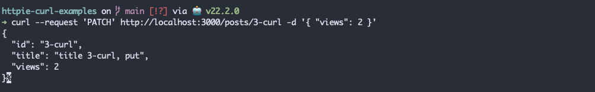

## httpie

```
http PATCH http://localhost:3000/posts/3-httpie views:=2
http PATCH localhost:3000/posts/3-httpie views:=2
echo '{ "views": 2 }' | http PATCH localhost:3000/posts/3-httpie
http PATCH localhost:3000/posts/3-httpie @./data/httpie-patch.json
http PATCH localhost:3000/posts/3-httpie < ./data/httpie-patch.json
```

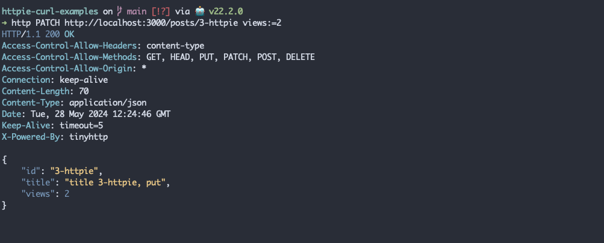

# DELETE (run previously POST, optionally PUT and PATCH, or return `404 Not found`)

## curl

```
curl --request 'DELETE' http://localhost:3000/posts/3-curl
curl -X 'DELETE' localhost:3000/posts/3-curl
```

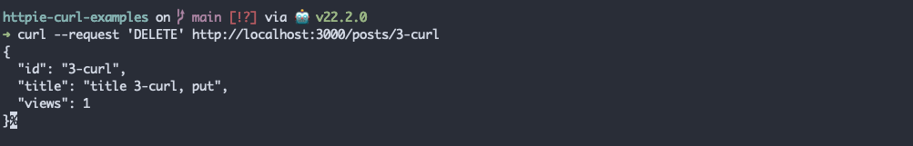

## httpie

```
http DELETE http://localhost:3000/posts/3-httpie
http DELETE localhost:3000/posts/3-httpie
```

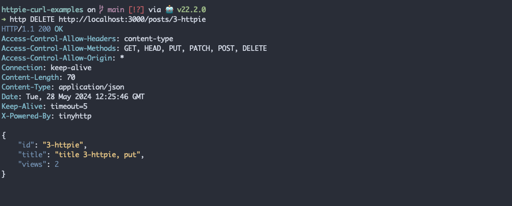
